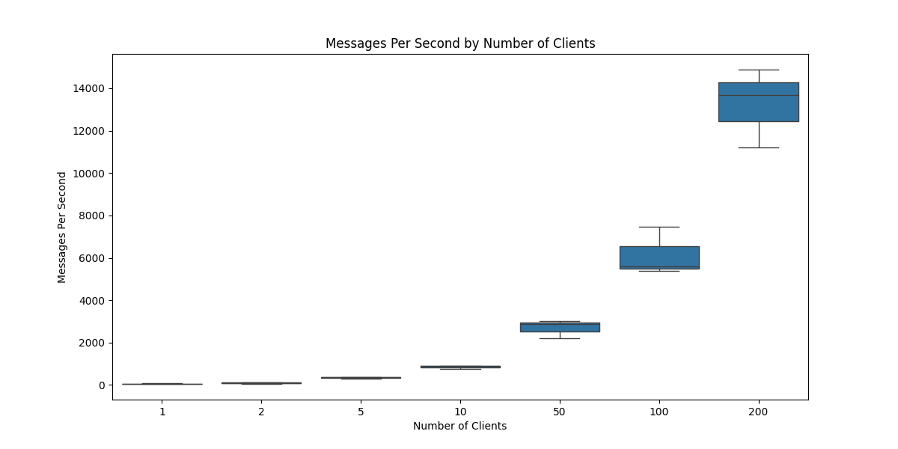
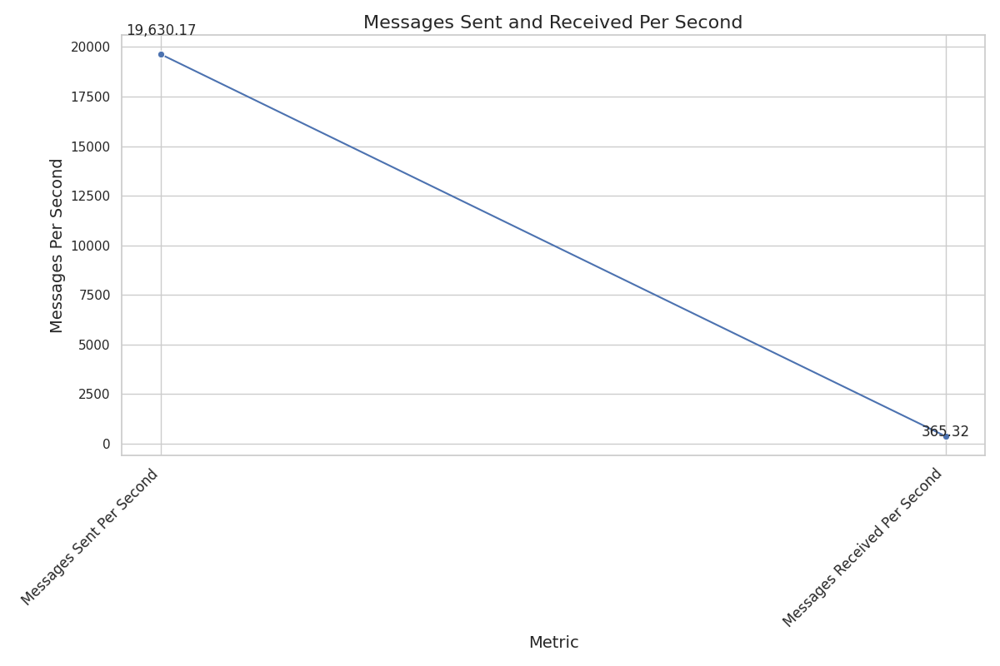
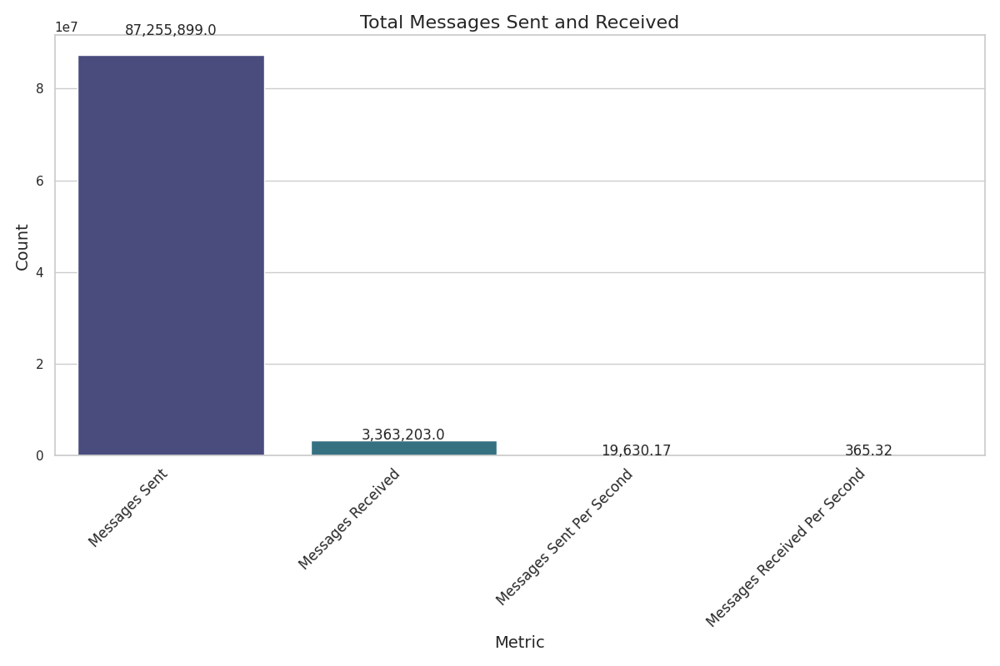
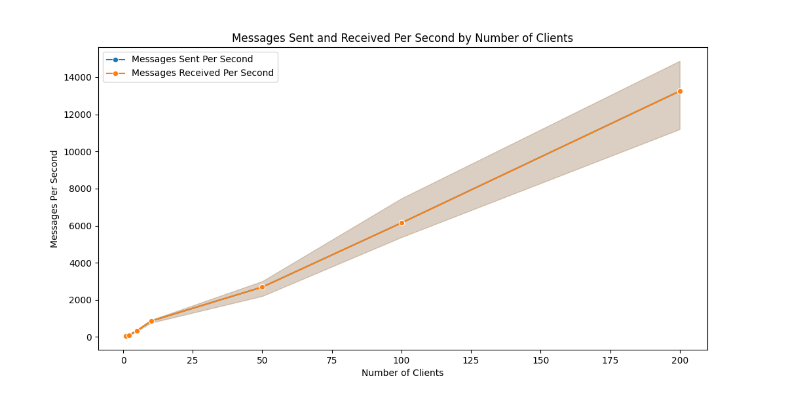
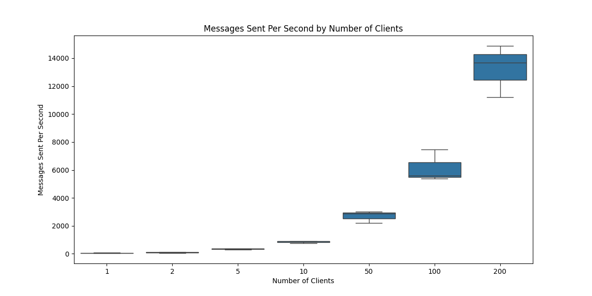

# Chat Server Performance Analysis

## Experimental Setup

- **Server**: Hosted on a separate machine from the clients.
- **Clients**: Test clients sending messages as fast as possible.
- **Experiments**: Conducted with different numbers of clients (1, 2, 5, 10, 50, 100, 200).
- **Duration**: Each experiment ran for 5 minutes.
- **Metrics**: Number of messages sent and received per second.

## Results

### Combined Data

| Clients | Repeat | Start Time | End Time   | Duration | Messages Sent | Messages Received | Messages Per Second |
|---------|--------|------------|------------|----------|---------------|-------------------|---------------------|
| 1       | 1      | 1728673456 | 1728673816 | 360      | 28972         | 28972             | 80.48               |
| 1       | 2      | 1728673816 | 1728674176 | 360      | 20879         | 20879             | 57.99               |
| 1       | 3      | 1728674176 | 1728674538 | 362      | 18865         | 18865             | 52.11               |
| 2       | 1      | 1728674538 | 1728674966 | 428      | 23979         | 23979             | 56.03               |
| 2       | 2      | 1728674966 | 1728675328 | 362      | 45501         | 45501             | 125.69              |
| 2       | 3      | 1728675328 | 1728675688 | 360      | 37613         | 37613             | 104.48              |
| 5       | 1      | 1728675688 | 1728676049 | 361      | 130915        | 130915            | 362.79              |
| 5       | 2      | 1728676049 | 1728676410 | 361      | 131398        | 131398            | 363.94              |
| 5       | 3      | 1728676410 | 1728676770 | 360      | 112770        | 112770            | 313.25              |
| 10      | 1      | 1728676770 | 1728677131 | 361      | 275558        | 275558            | 763.34              |
| 10      | 2      | 1728677131 | 1728677491 | 360      | 325477        | 325477            | 904.10              |
| 10      | 3      | 1728677491 | 1728677851 | 360      | 328671        | 328671            | 912.42              |
| 50      | 1      | 1728672605 | 1728672966 | 361      | 851974        | 851974            | 2360.34             |
| 50      | 2      | 1728672966 | 1728673328 | 362      | 1115333       | 1115333           | 3080.15             |
| 50      | 3      | 1728673329 | 1728673690 | 361      | 1562213       | 1562213           | 4327.45             |
| 50      | 1      | 1728674360 | 1728674789 | 429      | 945652        | 945652            | 2204.54             |
| 50      | 2      | 1728674789 | 1728675150 | 361      | 1084786       | 1084786           | 3005.51             |
| 50      | 3      | 1728675150 | 1728675510 | 360      | 1031209       | 1031209           | 2864.47             |
| 100     | 1      | 1728673691 | 1728674053 | 362      | 2554420       | 2554420           | 7057.57             |
| 100     | 2      | 1728674054 | 1728674415 | 361      | 1942390       | 1942390           | 5381.71             |
| 100     | 3      | 1728674416 | 1728674845 | 429      | 1462467       | 1462467           | 3408.79             |
| 100     | 1      | 1728675511 | 1728675871 | 360      | 1935697       | 1935697           | 5376.94             |
| 100     | 2      | 1728675872 | 1728676232 | 360      | 2689388       | 2689388           | 7470.52             |
| 100     | 3      | 1728676233 | 1728676594 | 361      | 2021353       | 2021353           | 5598.20             |
| 200     | 1      | 1728674845 | 1728675222 | 377      | 2469277       | 2469277           | 6550.46             |
| 200     | 2      | 1728675223 | 1728675618 | 395      | 2701877       | 2701877           | 6840.45             |
| 200     | 3      | 1728675620 | 1728676048 | 428      | 2022803       | 2022803           | 4726.18             |
| 200     | 1      | 1728676595 | 1728676963 | 368      | 4119920       | 4119920           | 11196.20            |
| 200     | 2      | 1728676964 | 1728677330 | 366      | 5446527       | 5446527           | 14878.99            |
| 200     | 3      | 1728677331 | 1728677708 | 377      | 5160064       | 5160064           | 13688.99            |

## Summary Statistics

| Clients | Mean Messages Per Second | Std Dev Messages Per Second |
|---------|--------------------------|-----------------------------|
| 1       | 63.53                    | 14.97                       |
| 2       | 95.40                    | 35.71                       |
| 5       | 346.63                   | 28.91                       |
| 10      | 860.13                   | 83.96                       |
| 50      | 2691.24                  | 427.50                      |
| 100     | 6148.92                  | 1149.93                     |
| 200     | 13254.61                 | 1880.58                     |

### Graphs

## Analysis

### Impact of Number of Clients

- As the number of clients increases, the average number of messages sent an received per second also increases.
- The standard deviation also increases with the number of clients, indicating more variability in performance.

### Performance Degradation

- Anecdotally, the performance degradation appears to be nearly linear linear(as seen by ). As the number of clients increases, the average messages per second increases by a some amount.
- This linear degradation is likely due to the increased overhead of handling more clients and the limitations of the server's processing power.

## Conclusion

- Running more clients affects the performance of the server, increasing the average number of messages sent per second.
- The performance degradation appears to be linear, suggesting that the server can handle a moderate increase in clients without a significant drop in performance.
- Further optimization and scaling strategies may be needed to handle a larger number of clients efficiently.
